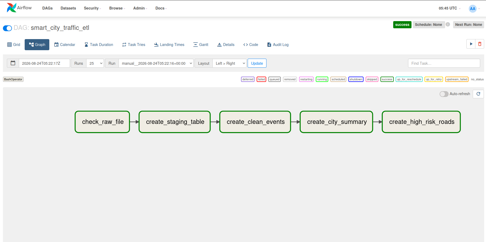

# Smart City Traffic ETL Pipeline

A small end-to-end Data Engineering project that processes traffic events from major Saudi cities using **HDFS, Hive, Airflow, Docker, and Parquet**.

The pipeline ingests raw traffic event data, cleans invalid records, generates city-level traffic statistics, and identifies high-risk roads.

## Architecture

```text
traffic_events.csv
        ↓
      HDFS
        ↓
Hive Staging Table
        ↓
Clean Traffic Events
     (Parquet)
        ↓
   ┌───────────────┐
   ↓               ↓
City Traffic    High-Risk
Summary         Roads
        ↑
      Airflow
```

## Airflow DAG

The pipeline is orchestrated with Apache Airflow.



The DAG contains five tasks:

```text
check_raw_file
      ↓
create_staging_table
      ↓
create_clean_events
      ↓
create_city_summary
      ↓
create_high_risk_roads
```

## Dataset

The raw dataset contains simulated traffic events from:

* Riyadh
* Medina
* Jeddah
* Khobar
* Mecca

Columns:

| Column          | Description                   |
| --------------- | ----------------------------- |
| `event_id`      | Unique traffic event ID       |
| `road_id`       | Road identifier               |
| `city`          | City where the event occurred |
| `event_type`    | Type of traffic event         |
| `speed_kmh`     | Recorded traffic speed        |
| `vehicle_count` | Number of vehicles            |
| `severity`      | Event severity from 1 to 5    |
| `event_time`    | Date and time of the event    |

Supported event types:

* `ACCIDENT`
* `CONGESTION`
* `ROAD_CLOSED`
* `NORMAL`

## HDFS Raw Layer

The raw CSV file is stored in HDFS:

```text
/data/traffic/raw/traffic_events.csv
```

Hive uses this location as the source for the external staging table.

## Hive Staging Layer

The raw HDFS data is exposed through:

```text
traffic.stg_traffic_events
```

This external Hive table allows the raw CSV data to be queried using SQL without moving it from the HDFS raw layer.

## Data Cleaning

The cleaned data is stored in Parquet format in:

```text
traffic.clean_traffic_events
```

Records are considered valid when:

```sql
speed_kmh >= 0
AND vehicle_count >= 0
AND severity BETWEEN 1 AND 5
AND event_type IN (
    'ACCIDENT',
    'CONGESTION',
    'ROAD_CLOSED',
    'NORMAL'
)
```

Using Parquet provides a more efficient analytical storage format than raw CSV.

## City Traffic Summary

The pipeline generates:

```text
traffic.city_traffic_summary
```

with the following metrics:

```text
city
total_events
accident_count
avg_speed
total_vehicles
```

Example:

```text
Riyadh | 3 | 2 | 20.0 | 395
Medina | 2 | 0 | 52.5 | 170
Jeddah | 2 | 1 | 45.0 | 215
Khobar | 2 | 0 | 37.5 | 75
Mecca  | 1 | 0 | 30.0 | 200
```

## High-Risk Roads

The pipeline also identifies potentially high-risk roads.

An event is considered high risk when:

```sql
severity >= 4
OR event_type = 'ACCIDENT'
```

The resulting table is:

```text
traffic.high_risk_roads
```

and contains:

```text
road_id
city
high_risk_events
max_severity
```

## Technologies

* Apache Airflow
* Apache Hadoop / HDFS
* Apache Hive
* Apache YARN
* Parquet
* Docker
* Python
* SQL
* Linux

## Project Structure

```text
smart-city-traffic-etl/
├── dags/
│   └── smart_city_traffic_etl.py
├── data/
│   └── raw/
│       └── traffic_events.csv
├── images/
│   └── airflow-dag.png
├── .gitignore
└── README.md
```

## Pipeline Goal

The goal of this project is to demonstrate a small but complete Data Engineering workflow:

1. Store raw data in HDFS.
2. Expose the raw data through a Hive staging table.
3. Validate and clean traffic records.
4. Store processed data in Parquet format.
5. Generate analytical summary tables.
6. Identify high-risk traffic events.
7. Orchestrate the complete workflow using Apache Airflow.
